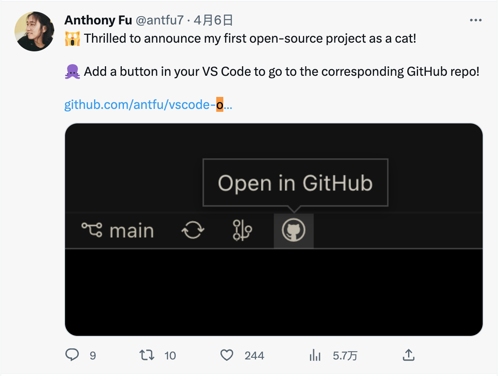

# vscode-open-in-github-button-analysis

vscode-open-in-github-button-analysis

## 1. 前言

大家好，我是[若川](https://lxchuan12.gitee.io)。我倾力持续组织了一年多[每周大家一起学习200行左右的源码共读活动](https://juejin.cn/post/7079706017579139102)，感兴趣的可以[点此扫码加我微信 `ruochuan02` 参与](https://juejin.cn/pin/7217386885793595453)。另外，想学源码，极力推荐关注我写的专栏[《学习源码整体架构系列》](https://juejin.cn/column/6960551178908205093)，目前是掘金关注人数（4.7k+人）第一的专栏，写有20余篇源码文章。

最近 `antfu` 在 `Twitter` 上发推开发了一个 [`VSCode`](https://github.com/antfu/vscode-open-in-github-button) 插件。



学完本文，你将学到：

```sh
1. 如何开发一个 VSCode 插件
2. 学会开发开源项目的工作流是怎样的
3. 学会 open in github button vscode 插件的原理是什么
```

## package.json script 命令解析

依赖包分析

@antfu/eslint-config
@antfu/ni
@types/node
@types/vscode
bumpp
eslint
esno
pnpm
vite
vitest
vsce

script 分析

```json
{
    "scripts": {
        "build": "tsup src/index.ts --external vscode",
        "dev": "nr build --watch",
        "lint": "eslint .",
        "vscode:prepublish": "nr build",
        "publish": "vsce publish --no-dependencies",
        "pack": "vsce package --no-dependencies",
        "test": "vitest",
        "typecheck": "tsc --noEmit",
        "release": "bumpp && nr publish"
    }
}
```

## index.ts

```js
import { StatusBarAlignment, window } from 'vscode'

export function activate() {
  const statusBar = window.createStatusBarItem(StatusBarAlignment.Left, 0)
  statusBar.command = 'openInGitHub.openProject'
  statusBar.text = '$(github)'
  statusBar.tooltip = 'Open in GitHub'
  statusBar.show()
}

export function deactivate() {

}
```


### openInGitHub.openProject

Edge 浏览器可以翻译成中文。
[VSCode](https://marketplace.visualstudio.com/VSCode)
[vscode api](https://code.visualstudio.com/api)


## github actions

### ci

```yml
name: CI

on:
  push:
    branches:
      - main

  pull_request:
    branches:
      - main

jobs:
  lint:
    runs-on: ubuntu-latest
    steps:
      - uses: actions/checkout@v3

      - name: Install pnpm
        uses: pnpm/action-setup@v2

      - name: Set node
        uses: actions/setup-node@v3
        with:
          node-version: 16.x
          cache: pnpm

      - name: Setup
        run: npm i -g @antfu/ni

      - name: Install
        run: nci

      - name: Lint
        run: nr lint

  typecheck:
    runs-on: ubuntu-latest
    steps:
      - uses: actions/checkout@v3

      - name: Install pnpm
        uses: pnpm/action-setup@v2

      - name: Set node
        uses: actions/setup-node@v3
        with:
          node-version: 16.x
          cache: pnpm

      - name: Setup
        run: npm i -g @antfu/ni

      - name: Install
        run: nci

      - name: Typecheck
        run: nr typecheck

  test:
    runs-on: ${{ matrix.os }}

    strategy:
      matrix:
        node: [16.x]
        os: [ubuntu-latest, windows-latest, macos-latest]
      fail-fast: false

    steps:
      - uses: actions/checkout@v3

      - name: Install pnpm
        uses: pnpm/action-setup@v2

      - name: Set node version to ${{ matrix.node }}
        uses: actions/setup-node@v3
        with:
          node-version: ${{ matrix.node }}
          cache: pnpm

      - name: Setup
        run: npm i -g @antfu/ni

      - name: Install
        run: nci

      - name: Build
        run: nr build

      - name: Test
        run: nr test
```

### release

```yml
name: Release

permissions:
  contents: write

on:
  push:
    tags:
      - 'v*'

jobs:
  release:
    runs-on: ubuntu-latest
    steps:
      - uses: actions/checkout@v3
        with:
          fetch-depth: 0

      - uses: actions/setup-node@v3
        with:
          node-version: 16.x

      - run: npx changelogithub
        env:
          GITHUB_TOKEN: ${{secrets.GITHUB_TOKEN}}
```

[](secrets.GITHUB_TOKEN)


### vitest

```js
// test/index.test.ts
import { describe, expect, it } from 'vitest'

describe('should', () => {
  it('exported', () => {
    expect(1).toEqual(1)
  })
})
```

## 总结

---

**如果看完有收获，欢迎点赞、评论、分享支持。你的支持和肯定，是我写作的动力**。

## 加源码共读交流群

最后可以持续关注我[@若川](https://juejin.cn/user/1415826704971918)。另外，想学源码，极力推荐关注我写的专栏[《学习源码整体架构系列》](https://juejin.cn/column/6960551178908205093)，目前是掘金关注人数（4.7k+人）第一的专栏，写有20余篇源码文章。

我倾力持续组织了一年多[每周大家一起学习200行左右的源码共读活动](https://juejin.cn/post/7079706017579139102)，感兴趣的可以[点此扫码加我微信 `ruochuan02` 参与](https://juejin.cn/pin/7217386885793595453)。
