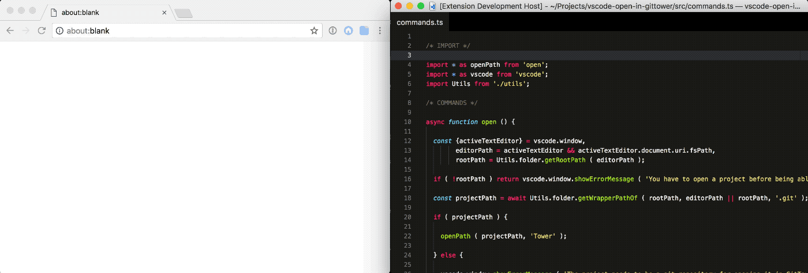
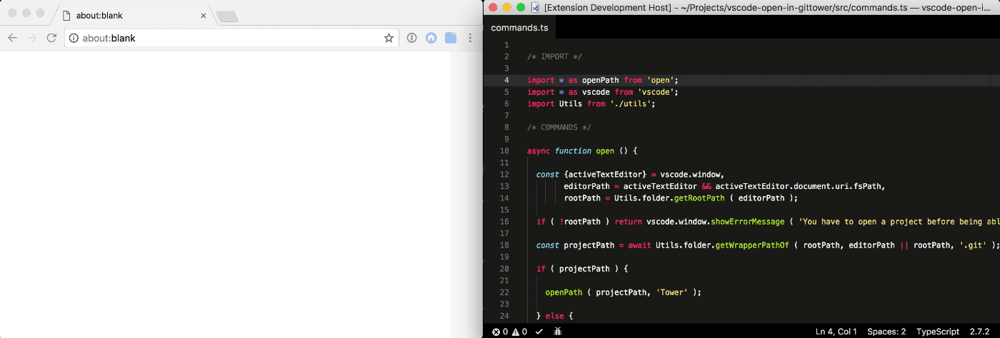
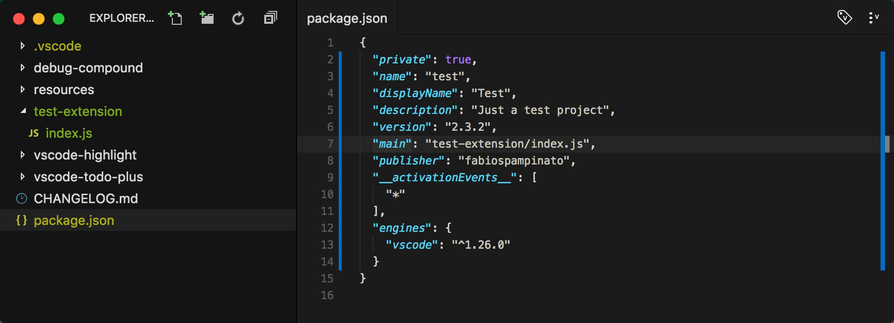

# vscode-open-in-github-button-analysis

vscode-open-in-github-button-analysis

## 1. 前言

大家好，我是[若川](https://lxchuan12.gitee.io)。我倾力持续组织了一年多[每周大家一起学习200行左右的源码共读活动](https://juejin.cn/post/7079706017579139102)，感兴趣的可以[点此扫码加我微信 `ruochuan02` 参与](https://juejin.cn/pin/7217386885793595453)。另外，想学源码，极力推荐关注我写的专栏[《学习源码整体架构系列》](https://juejin.cn/column/6960551178908205093)，目前是掘金关注人数（4.7k+人）第一的专栏，写有20余篇源码文章。

最近 `antfu` 在 `Twitter` 上发推开发了一个 [`VSCode`](https://github.com/antfu/vscode-open-in-github-button) 插件。


学完本文，你将学到：

```sh
1. 如何开发一个 VSCode 插件
2. 学会开发开源项目的工作流是怎样的
3. 学会 open in github button vscode 插件的原理是什么
```

## package.json script 命令解析

依赖包分析

@antfu/eslint-config
@antfu/ni
@types/node
@types/vscode
bumpp
eslint
esno
pnpm
vite
vitest
vsce

script 分析

```json
{
    "scripts": {
        "build": "tsup src/index.ts --external vscode",
        "dev": "nr build --watch",
        "lint": "eslint .",
        "vscode:prepublish": "nr build",
        "publish": "vsce publish --no-dependencies",
        "pack": "vsce package --no-dependencies",
        "test": "vitest",
        "typecheck": "tsc --noEmit",
        "release": "bumpp && nr publish"
    }
}
```

## index.ts

```ts
import { StatusBarAlignment, window } from 'vscode'

export function activate() {
  const statusBar = window.createStatusBarItem(StatusBarAlignment.Left, 0)
  statusBar.command = 'openInGitHub.openProject'
  statusBar.text = '$(github)'
  statusBar.tooltip = 'Open in GitHub'
  statusBar.show()
}

export function deactivate() {

}
```

### openInGitHub.openProject

Edge 浏览器可以翻译成中文。
[VSCode](https://marketplace.visualstudio.com/VSCode)
[vscode api](https://code.visualstudio.com/api)

```json
{
  "extensionPack": [
    "fabiospampinato.vscode-open-in-github"
  ],
}
```

我们来看这个插件，[vscode-open-in-github](https://github.com/fabiospampinato/vscode-open-in-github.git)。

>open-on




**Contributing**

If you found a problem, or have a feature request, please open an [issue](https://github.com/fabiospampinato/vscode-open-in-github/issues) about it.

If you want to make a pull request you can debug the extension using [Debug Launcher](https://marketplace.visualstudio.com/items?itemName=fabiospampinato.vscode-debug-launcher).

调试，安装作者推荐的调试工具 `Debug Launcher`。



## package.json

```json
{
  "main": "out/extension.js",
}
```

## 调试项目

克隆项目，然后安装依赖

```bash
npm install
# 或者
# npm i -g yarn
yarn install
# 或者
# npm i -g pnpm
pnpm install
```

选中，`"main": "out/extension.js"`，按 `ctrl + shift + p`。输入选择 `debug launcher auto` 即可调试。

`webpack.config.js` 配置

```ts
const config = {
  target: 'node',
  entry: './src/extension.ts',
}
```

## 入口 src/extension.ts

```ts

/* IMPORT */

import Utils from './utils';

/* ACTIVATE */

const activate = Utils.initCommands;

/* EXPORT */

export {activate};

```

### Utils

```ts

/* IMPORT */

import * as _ from 'lodash';
import * as absolute from 'absolute';
import * as findUp from 'find-up';
import * as path from 'path';
import * as pify from 'pify';
import * as simpleGit from 'simple-git';
import * as vscode from 'vscode';
import * as Commands from './commands';
import Config from './config';

/* UTILS */

const Utils = {

  initCommands ( context: vscode.ExtensionContext ) {

    const {commands} = vscode.extensions.getExtension ( 'fabiospampinato.vscode-open-in-github' ).packageJSON.contributes;

    commands.forEach ( ({ command, title }) => {

      const commandName = _.last ( command.split ( '.' ) ) as string,
            handler = Commands[commandName],
            disposable = vscode.commands.registerCommand ( command, () => handler () );

      context.subscriptions.push ( disposable );

    });

    return Commands;

  },
}
```

### Commands

```ts
// vscode-open-in-github/src/commands.ts
/* IMPORT */

import URL from './url';

/* COMMANDS */

function openProject () {

  return URL.open ();

}

export { openProject };
```

### URL

```ts

/* IMPORT */

import * as _ from 'lodash';
import * as vscode from 'vscode';
import Config from './config';
import Utils from './utils';

/* URL */

const URL = {
  async get ( file = false, permalink = false, page? ) {},
  async copy ( file = false, permalink = false, page? ) {},
  async open ( file = false, permalink = false, page? ) {

    const url = await URL.get ( file, permalink, page );

    vscode.env.openExternal ( vscode.Uri.parse ( url ) );

  }
}
```

#### URL.get 函数

```ts
const URL = {
  async get ( file = false, permalink = false, page? ) {

    const repopath = await Utils.repo.getPath ();

    if ( !repopath ) return vscode.window.showErrorMessage ( 'You have to open a git project before being able to open it in GitHub' );

    const git = Utils.repo.getGit ( repopath ),
          repourl = await Utils.repo.getUrl ( git );

    if ( !repourl ) return vscode.window.showErrorMessage ( 'Remote repository not found' );

    const config = Config.get ();

    let filePath = '',
        branch = '',
        lines = '',
        hash = '';

    // 省略 file 的逻辑

    branch = encodeURIComponent ( branch );
    filePath = encodeURIComponent ( filePath ).replace ( /%2F/g, '/' );

    const url = _.compact ([ repourl, page, branch, hash, filePath, lines ]).join ( '/' );

    return url;

  },
}
```

## github actions

一个开源项目，一般会有基础的 workflow。

- ci 每次 git push 命令时自动执行 lint 和 test 等，保证校验通过。
- release：每次检测到 git tag，就自动发一个包。

### ci

```yml
name: CI

on:
  push:
    branches:
      - main

  pull_request:
    branches:
      - main

jobs:
  lint:
    runs-on: ubuntu-latest
    steps:
      - uses: actions/checkout@v3

      - name: Install pnpm
        uses: pnpm/action-setup@v2

      - name: Set node
        uses: actions/setup-node@v3
        with:
          node-version: 16.x
          cache: pnpm

      - name: Setup
        run: npm i -g @antfu/ni

      - name: Install
        run: nci

      - name: Lint
        run: nr lint

  typecheck:
    runs-on: ubuntu-latest
    steps:
      - uses: actions/checkout@v3

      - name: Install pnpm
        uses: pnpm/action-setup@v2

      - name: Set node
        uses: actions/setup-node@v3
        with:
          node-version: 16.x
          cache: pnpm

      - name: Setup
        run: npm i -g @antfu/ni

      - name: Install
        run: nci

      - name: Typecheck
        run: nr typecheck

  test:
    runs-on: ${{ matrix.os }}

    strategy:
      matrix:
        node: [16.x]
        os: [ubuntu-latest, windows-latest, macos-latest]
      fail-fast: false

    steps:
      - uses: actions/checkout@v3

      - name: Install pnpm
        uses: pnpm/action-setup@v2

      - name: Set node version to ${{ matrix.node }}
        uses: actions/setup-node@v3
        with:
          node-version: ${{ matrix.node }}
          cache: pnpm

      - name: Setup
        run: npm i -g @antfu/ni

      - name: Install
        run: nci

      - name: Build
        run: nr build

      - name: Test
        run: nr test
```

### release

```yml
name: Release

permissions:
  contents: write

on:
  push:
    tags:
      - 'v*'

jobs:
  release:
    runs-on: ubuntu-latest
    steps:
      - uses: actions/checkout@v3
        with:
          fetch-depth: 0

      - uses: actions/setup-node@v3
        with:
          node-version: 16.x

      - run: npx changelogithub
        env:
          GITHUB_TOKEN: ${{secrets.GITHUB_TOKEN}}
```

[自动令牌身份验证 secrets.GITHUB_TOKEN](https://docs.github.com/zh/actions/security-guides/automatic-token-authentication)

### vitest

```js
// test/index.test.ts
import { describe, expect, it } from 'vitest'

describe('should', () => {
  it('exported', () => {
    expect(1).toEqual(1)
  })
})
```

## 总结

---

**如果看完有收获，欢迎点赞、评论、分享支持。你的支持和肯定，是我写作的动力**。

## 加源码共读交流群

最后可以持续关注我[@若川](https://juejin.cn/user/1415826704971918)。另外，想学源码，极力推荐关注我写的专栏[《学习源码整体架构系列》](https://juejin.cn/column/6960551178908205093)，目前是掘金关注人数（4.7k+人）第一的专栏，写有20余篇源码文章。

我倾力持续组织了一年多[每周大家一起学习200行左右的源码共读活动](https://juejin.cn/post/7079706017579139102)，感兴趣的可以[点此扫码加我微信 `ruochuan02` 参与](https://juejin.cn/pin/7217386885793595453)。
